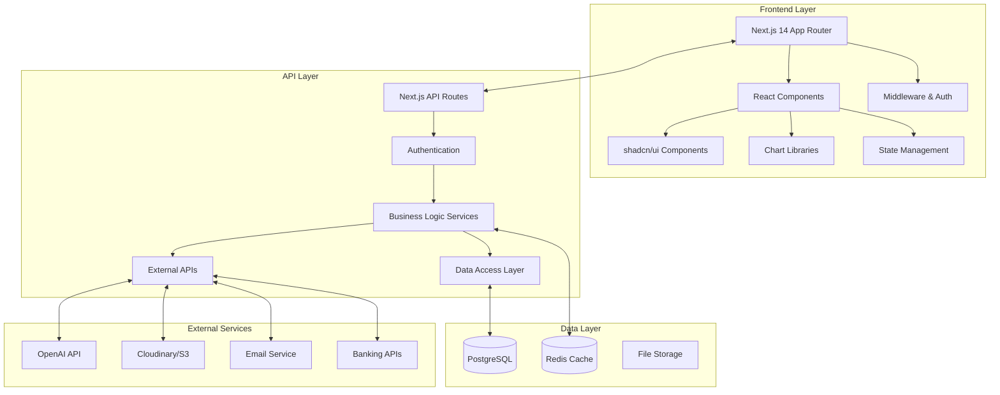
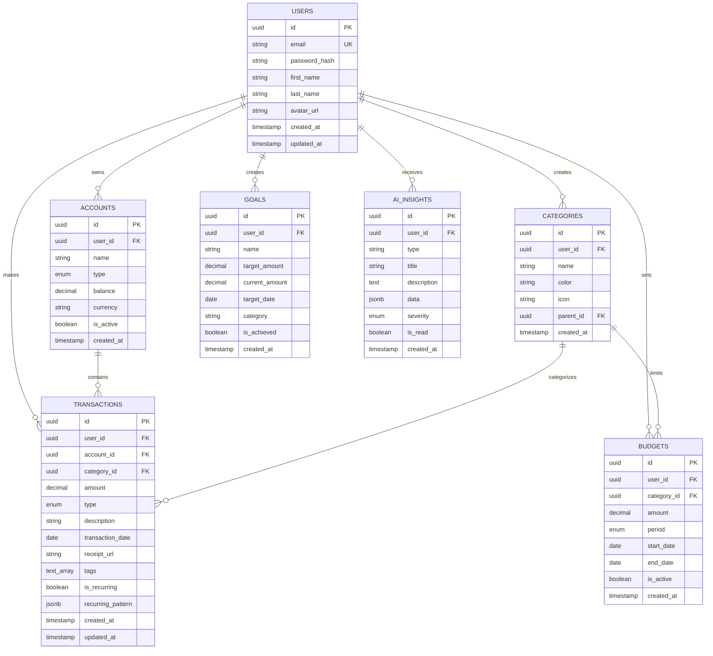
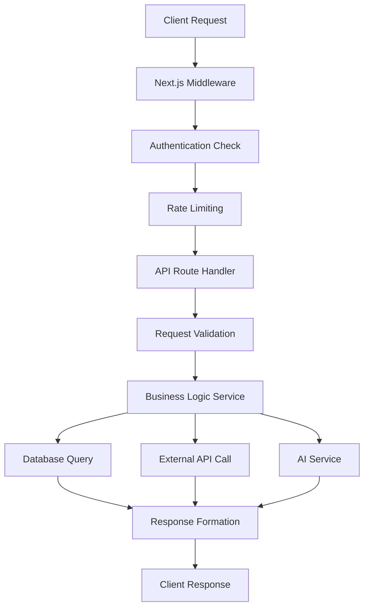
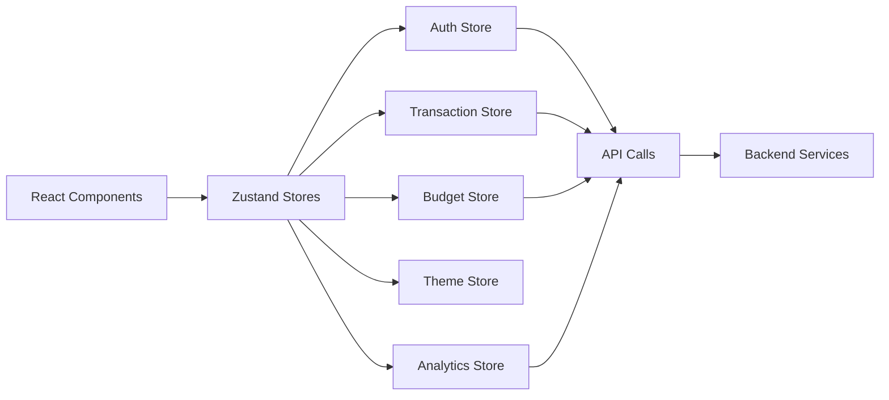
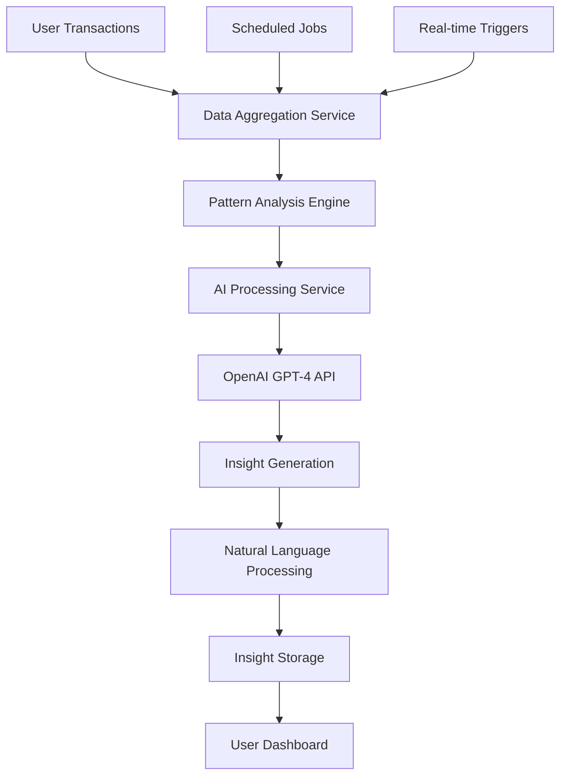
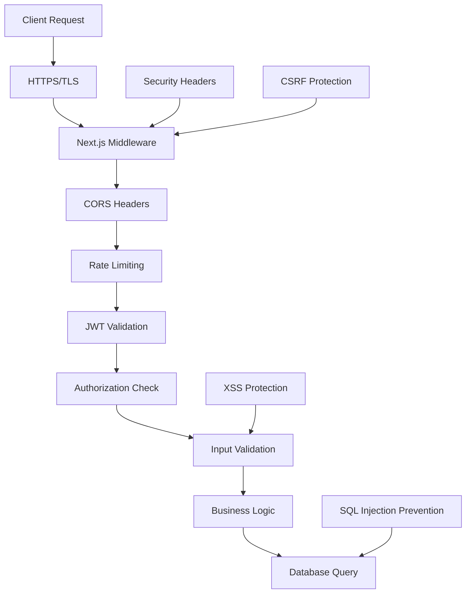
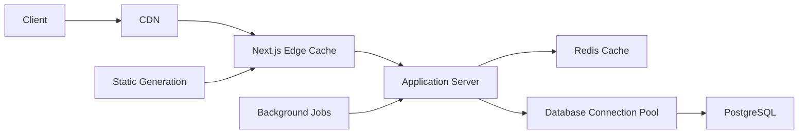
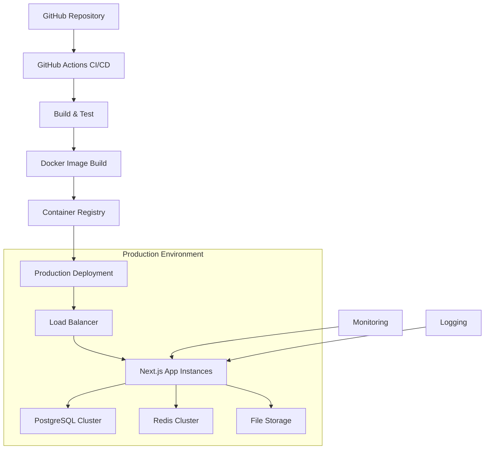

# Personal Finance Dashboard - Complete Architecture

## System Architecture Overview



## Tech Stack

### Frontend Technologies
```markdown
Framework: Next.js 14 (App Router)
Language: TypeScript
Styling: Tailwind CSS
UI Components: shadcn/ui
Charts: Recharts + Chart.js + D3.js
State Management: Zustand
Forms: React Hook Form + Zod
Authentication: NextAuth.js
Theme: next-themes (Dark/Light mode)
Icons: Lucide React
Animations: Framer Motion
Date Handling: date-fns
HTTP Client: Built-in fetch
Build Tool: Turbopack
```

### Backend Technologies
```markdown
API: Next.js API Routes
Database: PostgreSQL
ORM: Prisma
Caching: Redis
Authentication: NextAuth.js + JWT
File Upload: Cloudinary
AI Service: OpenAI GPT-4
Email: Resend
Validation: Zod
Rate Limiting: @upstash/ratelimit
Environment: Node.js 18+
```

## Project Structure

```
personal-finance-dashboard/
├── app/
│   ├── (auth)/
│   │   ├── login/page.tsx
│   │   └── register/page.tsx
│   ├── (dashboard)/
│   │   ├── dashboard/page.tsx
│   │   ├── transactions/
│   │   │   ├── page.tsx
│   │   │   └── [id]/page.tsx
│   │   ├── budgets/page.tsx
│   │   ├── goals/page.tsx
│   │   ├── analytics/page.tsx
│   │   └── settings/page.tsx
│   ├── api/
│   │   ├── auth/[...nextauth]/route.ts
│   │   ├── transactions/
│   │   │   ├── route.ts
│   │   │   ├── [id]/route.ts
│   │   │   ├── bulk/route.ts
│   │   │   └── export/route.ts
│   │   ├── budgets/
│   │   │   ├── route.ts
│   │   │   └── [id]/route.ts
│   │   ├── analytics/
│   │   │   ├── spending-trends/route.ts
│   │   │   └── category-breakdown/route.ts
│   │   ├── insights/ai-analysis/route.ts
│   │   └── upload/route.ts
│   ├── globals.css
│   ├── layout.tsx
│   └── page.tsx
├── components/
│   ├── ui/                    # shadcn/ui components
│   ├── layout/                # Layout components
│   ├── charts/                # Chart components
│   ├── dashboard/             # Dashboard-specific components
│   ├── transactions/          # Transaction components
│   ├── budgets/               # Budget components
│   └── common/                # Shared components
├── lib/
│   ├── auth.ts               # NextAuth configuration
│   ├── db.ts                 # Prisma client
│   ├── validations.ts        # Zod schemas
│   ├── utils.ts              # Utility functions
│   ├── ai-service.ts         # AI insights service
│   └── constants.ts          # App constants
├── hooks/                    # Custom React hooks
├── stores/                   # Zustand stores
├── types/                    # TypeScript types
├── prisma/
│   ├── schema.prisma
│   ├── migrations/
│   └── seed.ts
└── public/
```

## Database Architecture



## API Architecture



### API Endpoints Structure

```markdown
Authentication:
POST   /api/auth/login
POST   /api/auth/register
POST   /api/auth/logout
GET    /api/auth/session

Transactions:
GET    /api/transactions          # List with filters
POST   /api/transactions          # Create new
GET    /api/transactions/[id]     # Get specific
PUT    /api/transactions/[id]     # Update
DELETE /api/transactions/[id]     # Delete
POST   /api/transactions/bulk     # Bulk import
GET    /api/transactions/export   # Export data

Budgets:
GET    /api/budgets              # List budgets
POST   /api/budgets              # Create budget
GET    /api/budgets/[id]         # Get specific
PUT    /api/budgets/[id]         # Update
DELETE /api/budgets/[id]         # Delete

Analytics:
GET    /api/analytics/spending-trends
GET    /api/analytics/category-breakdown
GET    /api/analytics/income-vs-expense
GET    /api/analytics/budget-performance

AI Insights:
POST   /api/insights/ai-analysis  # Generate insights
GET    /api/insights/history      # Get past insights

File Upload:
POST   /api/upload               # Receipt/document upload
```

## State Management Architecture



### Store Structure

Auth Store:
- user: User | null
- isLoading: boolean
- login(credentials)
- logout()
- register(userData)

Transaction Store:
- transactions: Transaction[]
- filters: TransactionFilters
- pagination: PaginationState
- isLoading: boolean
- fetchTransactions()
- addTransaction()
- updateTransaction()
- deleteTransaction()
- setFilters()

Budget Store:
- budgets: Budget[]
- budgetProgress: BudgetProgress[]
- isLoading: boolean
- fetchBudgets()
- createBudget()
- updateBudget()
- deleteBudget()

Analytics Store:
- spendingTrends: TrendData[]
- categoryBreakdown: CategoryData[]
- insights: AIInsight[]
- isLoading: boolean
- fetchAnalytics()
- generateInsights()

Theme Store:
- theme: 'light' | 'dark' | 'system'
- setTheme()

## AI Insights Architecture



### AI Insight Types

Spending Pattern Analysis:
- Monthly spending comparisons
- Category-wise trend analysis
- Unusual spending detection
- Seasonal pattern recognition

Budget Intelligence:
- Budget utilization alerts
- Overspending warnings
- Savings opportunity identification
- Goal achievement predictions

Personalized Recommendations:
- Cost optimization suggestions
- Investment recommendations
- Subscription audit insights
- Cash flow improvement tips

Behavioral Insights:
- Spending habit analysis
- Financial goal alignment
- Risk assessment
- Reward recognition

## Security Architecture



### Security Features

Authentication & Authorization:
- JWT tokens with refresh mechanism
- NextAuth.js integration
- Role-based access control
- Session management with Redis

Data Protection:
- Input validation with Zod
- SQL injection prevention via Prisma
- XSS protection
- CSRF token validation
- Rate limiting per endpoint

Infrastructure Security:
- HTTPS enforcement
- Security headers (HSTS, CSP, etc.)
- Environment variable protection
- API key rotation
- Database connection encryption

## Performance Architecture



### Performance Optimizations


Frontend Performance:
- Next.js App Router with streaming
- Static generation for public pages
- Image optimization with next/image
- Code splitting and lazy loading
- Bundle size optimization
- PWA capabilities

Backend Performance:
- Redis caching for frequently accessed data
- Database query optimization
- Connection pooling
- Background job processing
- API response compression
- CDN for static assets

Database Performance:
- Proper indexing strategy
- Query optimization
- Connection pooling
- Read replicas for analytics
- Scheduled data archiving

## Deployment Architecture



### Deployment Strategy


Development:
- Local development with Docker Compose
- Hot reloading with Next.js dev server
- Local PostgreSQL and Redis instances

Staging:
- Docker containers on cloud platform
- Managed database services
- CI/CD pipeline integration

Production:
- Kubernetes cluster or serverless deployment
- Auto-scaling based on traffic
- Multi-region deployment
- Database clustering with read replicas
- CDN integration
- Monitoring and alerting

## Chart Visualization Architecture


Chart Libraries Integration:
Primary: Recharts (React-native charts)
- Line charts for spending trends
- Bar charts for category comparisons
- Pie charts for budget allocation
- Area charts for cumulative data

Secondary: Chart.js (Canvas-based)
- Advanced interactive features
- Custom chart types
- Animation capabilities

Advanced: D3.js (Custom visualizations)
- Complex financial visualizations
- Interactive data exploration
- Custom dashboard widgets

Chart Types:
- Income vs Expense over time
- Category-wise spending breakdown
- Budget utilization progress
- Goal achievement tracking
- Monthly/yearly comparisons
- Trend analysis with predictions


This architecture provides a comprehensive foundation for building a production-ready personal finance dashboard that showcases modern web development practices, scalability, security, and AI-powered insights.